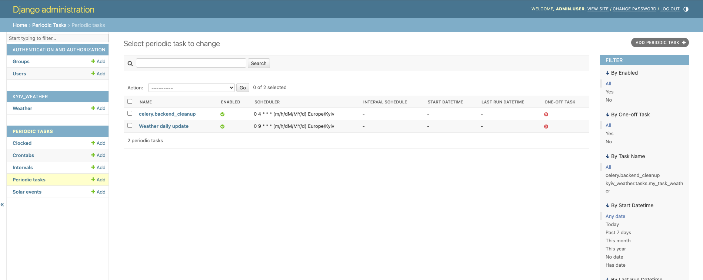
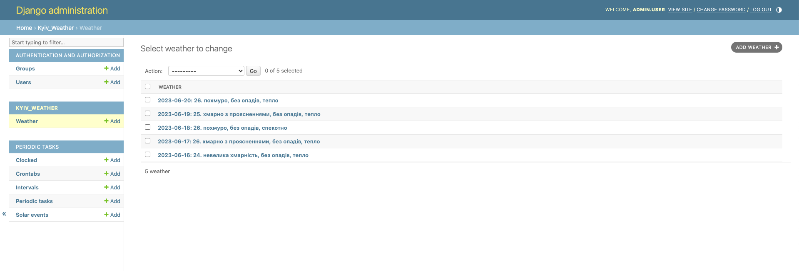
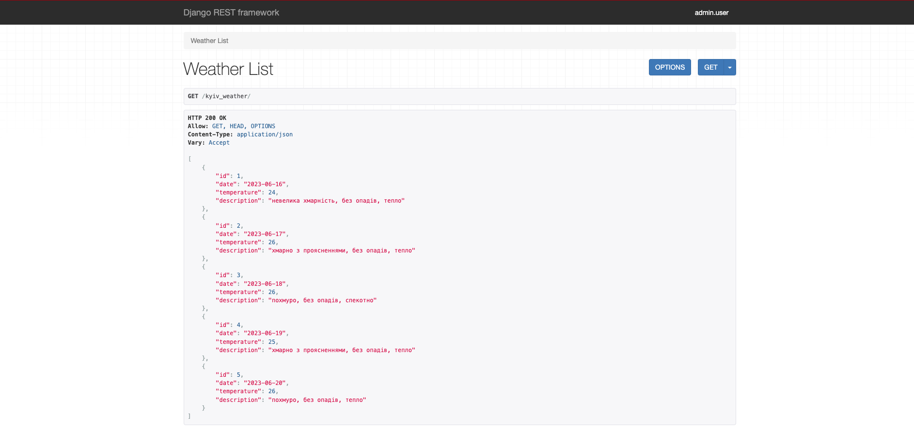
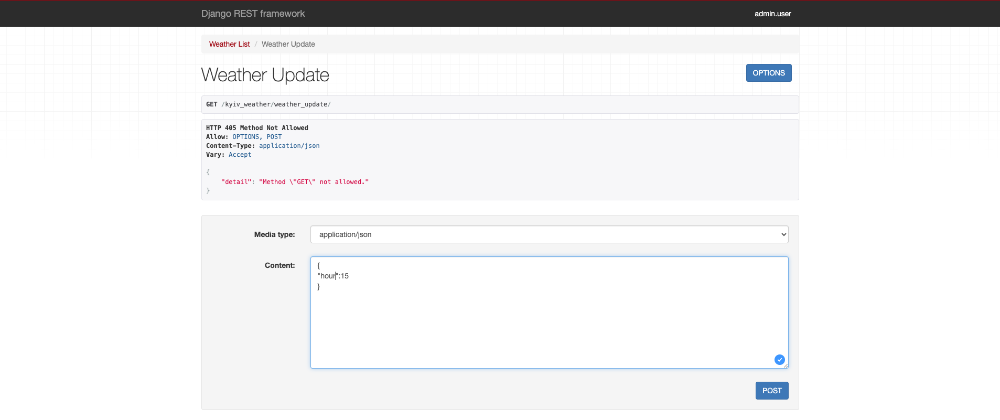
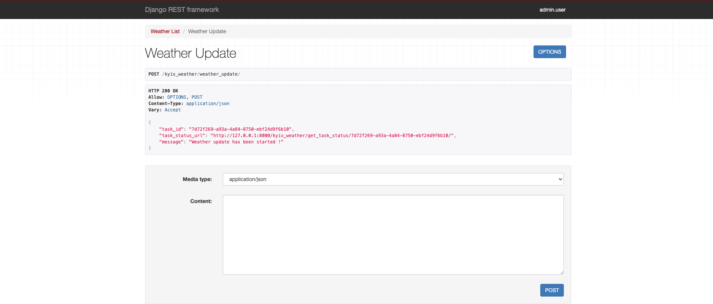
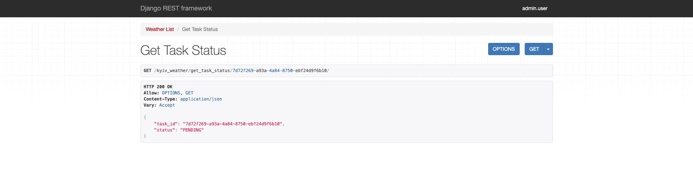
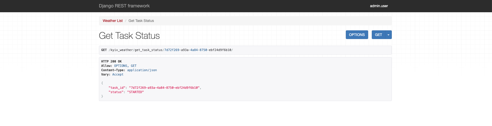
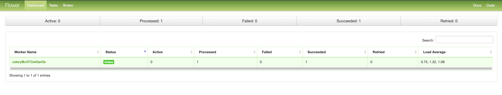
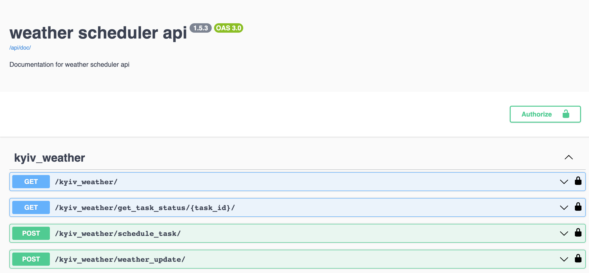

# 🌇 Weather-api-test-task
 API for daily weather tracking. This project is designed to fetch daily weather information for Kyiv for today and the next 5 days

## 🖥️ Technologies 


## 📝 Requirements

- Python 3.7+
- Django 4.2.1+
- PostgreSQL
- Docker

## 🛠 Before installation
1. Clone the project repository

```bash
git clone https://github.com/Anatolii-Poznyak/weather-api-test-task.git
cd weather-api-test-task
```
2. Create a virtual environment
```bash
python3 -m venv venv
source venv/bin/activate
```

3. Create .env file based on .env.sample file and set variables.

```bash
cp .env.sample .env
```

- If you want to use docker - set POSTGRES_HOST=db 

## 🐳 Run with DOCKER
- DOCKER should be installed

```shell
  docker-compose up
```
- server will run on 127.0.0.1:8000
- Create superuser from terminal to be able to login (enter the container)

```shell
docker ps
docker exec -it <your container name> /bin/bash
python manage.py createsuperuser
```

## 🖼 Demo pictures

<details>
  <summary>Admin page schedule</summary>

  
</details>
<details>
  <summary>Admin page weather</summary>

  
</details>
<details>
  <summary>Weather list endpoint</summary>

  
</details>

<details>
  <summary>Update endpoint</summary>

  
</details>
<details>
  <summary>Update start</summary>

  
</details>
<details>
  <summary>Pending status (status endpoint)</summary>

  
</details>
<details>
  <summary>Status started</summary>

  
</details>

<details>
  <summary>Flower task monitoring</summary>

  
</details>

## 📚 Additional info
- Schedule for day-basis updating information about the weather in Kyiv will be started automatically after `docker-compose up` command (by `python manage.py task_command`)
- You can also change the daily basis time for updating information also by adding an argument after command in terminal (example: `python manage.py task_command 17` -> will change time from 9:00 to 17:00). Also you can set this time parameter from the endpoint
- Flower schedule monitoring will be able on 5555 port (127.0.0.1:5000)
- Run tests `python manage.py test`
## 🕶 Documentation: swagger

```/api/doc/swagger/```

<details>
  <summary>Swagger</summary>

  
</details>
